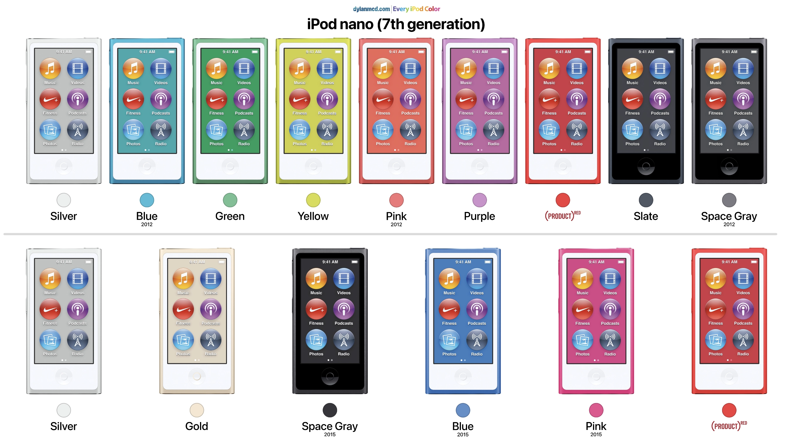
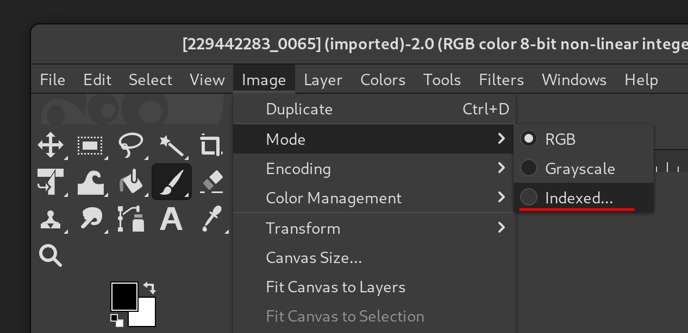
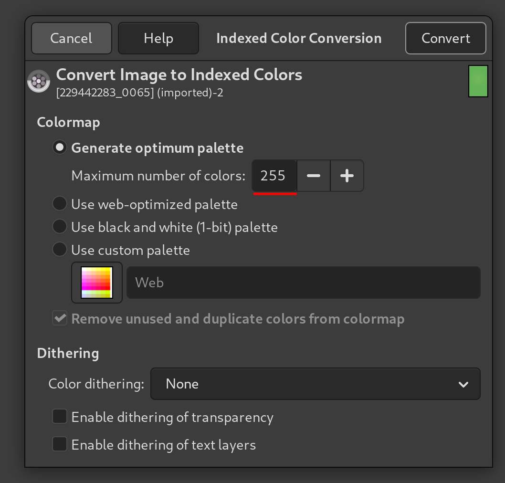
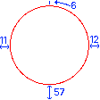

# iPod Nano 6th/7th gen Theming guide


### Table of Contents
1. [Pre-requisites](#pre-requisites)
2. [Step 1: Download ipod_theme repository](#step-1-download-ipod_theme-repository)
3. Gather assets
4. 


## Pre-requisites
- A 6th or 7th generation iPod Nano
- A USB cable to connect your iPod Nano to the computer
- A computer running Windows or Linux (macOS guide coming soon)
- A photo editing program like GIMP (Photoshop will probably work but GIMP is used in this guide.)
- Basic knowledge of what you're doing

## Basic information you need to know before getting started


### Revisions

The ipod nano 7th Generation has 2 revisions, one released in 2012, the other in 2015. The hardware differences are negligible, but the software is different for each.

Flashing the wrong firmware for your device shouldn't cause any issues, as iTunes should throw an error before trying to restore. If you are unsure which revision you have, the easiest way for most colors is to look at the color of your device.


[Image by Dylan McDonald](https://www.dylanmcd.com/blog/every-ipod-color/)

In case it's hard to tell by the color of your device, flashing either 2012 or 2015 firmware will not cause any issues, as iTunes will throw an error before trying to restore. That way you also can be sure you have the correct firmware for your device.

### Updating vs Restoring

Putting a custom IPSW on your device using the iTunes "Restore" function **will erase all content on your iPod** Make sure it's in your iTunes Library or otherwise backed up.

It's possible to update your iPod Nano to a custom firmware without erasing the content, but this is not covered in this guide. This guide will focus on restoring the iPod Nano to a custom firmware

### Bricking risk

While the odds of bricking your iPod are low, it's not without risk. If you are not comfortable with the risks, please do not proceed with this guide.

### My iPod doesn't boot after flashing a custom firmware! 

Due to how the [ipod_sun](https://github.com/CUB3D/ipod_sun) exploit works, this is expected behavior. To boot into osos/RetailOS/The regular firmware, hold the volume up and down buttons while booting your iPod.


## With that out of the way, let's get started!

## Step 1: Download ipod_theme repository
- Open a terminal and run the following command to clone the repository:
```bash
git clone https://github.com/nfzerox/ipod_theme .
```
- Change into the cloned directory:
```bash
cd ipod_theme 
```

## Gather assets

The iPod nano 7th generation comes a variety of colors. All of these colors have different assets for their wallpapers. On top of that, all wallpapers have a preview version that is shown in the settings app wallpaper picker.
The standard wallpaper resolution is 240x432 pixels, while the preview wallpapers are 200x117 pixels.

Below is a list of the wallpapers and their respective IDs as used in the assets folder:

(List may contain errors, I am working on refining and completing it in the near future.)
### Slate*
*Might not be correct as i have not been able to test this color yet

| Pattern  | Preview ID     | Full-Res ID     |
|----------|----------------|-----------------|
| Solid    | 229442228_0064 | 229442215_0064  |
| Striped  | 229442254_0064 | 229442241_0064  |
| Dotted   | 229442280_0064 | 229442267_0064  |
| Circles  | 229442306_0064 | 229442293_0064  |
| Neutral  | 229442229_0064 | 229442216_0064  |

### Silver

| Pattern  | Preview ID     | Full-Res ID     |
|----------|----------------|-----------------|
| Solid    | 229442229_0064 | 229442216_0064  |
| Striped  | 229442255_0064 | 229442242_0064  |
| Dotted   | 229442281_0064 | 229442268_0064  |
| Circles  | 229442307_0064 | 229442294_0064  |
| Neutral  | 229442228_0064 | 229442215_0064  |

### Blue

| Pattern  | Preview ID     | Full-Res ID     |
|----------|----------------|-----------------|
| Solid    | 229442230_0064 | 229442217_0064  |
| Striped  | 229442256_0064 | 229442243_0064  |
| Dotted   | 229442282_0065 | 229442269_0065  |
| Circles  | 229442308_0065 | 229442295_0065  |
| Neutral  | 229442323_0064 | 229442320_0064  |

### Green

| Pattern  | Preview ID     | Full-Res ID     |
|----------|----------------|-----------------|
| Solid    | 229442231_0064 | 229442218_0065  |
| Striped  | 229442257_0064 | 229442244_0064  |
| Dotted   | 229442283_0065 | 229442270_0065  |
| Circles  | 229442309_0065 | 229442296_0065  |
| Neutral  | 229442323_0064 | 229442320_0064  |

### Yellow

| Pattern  | Preview ID     | Full-Res ID     |
|----------|----------------|-----------------|
| Solid    | 229442232_0064 | 229442219_0064  |
| Striped  | 229442258_0064 | 229442245_0064  |
| Dotted   | 229442284_0065 | 229442271_0065  |
| Circles  | 229442310_0065 | 229442297_0065  |
| Neutral  | 229442229_0064 | 229442216_0064  |

### Pink

| Pattern  | Preview ID     | Full-Res ID     |
|----------|----------------|-----------------|
| Solid    | 229442233_0064 | 229442220_0064  |
| Striped  | 229442259_0064 | 229442246_0065  |
| Dotted   | 229442285_0065 | 229442272_0065  |
| Circles  | 229442311_0065 | 229442298_0065  |
| Neutral  | 229442229_0064 | 229442216_0064  |

### Purple

| Pattern  | Preview ID     | Full-Res ID     |
|----------|----------------|-----------------|
| Solid    | 229442234_0064 | 229442221_0064  |
| Striped  | 229442260_0064 | 229442247_0064  |
| Dotted   | 229442286_0065 | 229442273_0065  |
| Circles  | 229442312_0064 | 229442299_0065  |
| Neutral  | 229442229_0064 | 229442216_0064  |

### Red

| Pattern  | Preview ID     | Full-Res ID     |
|----------|----------------|-----------------|
| Solid    | 229442235_0064 | 229442222_0064  |
| Striped  | 229442261_0064 | 229442248_0064  |
| Dotted   | 229442287_0065 | 229442274_0065  |
| Circles  | 229442313_0065 | 229442300_0065  |
| Neutral  | 229442229_0064 | 229442216_0064  |


### Preparing custom wallpapers.
Find any wallpaper you like, and resize it to 240x432 pixels. 

Make sure to set the color format correctly for your wallpaper. You can determine the color format by looking at the last four digits of the wallpaper ID.

For example, 0064 is Indexed Color with 255 colors, while 0065 is Indexed Color with 65545 colors. Do not attempt to use more than the allowed colors as this can cause the later building step to fail. Using 255 colors for an image with 65545 colors is fine. Just make sure the filename reflects the original format of the wallpaper as listed above.

Set the color mode if the image as follows: (GIMP)

In the menubar, select `image` > `mode` > `indexed...`


Then set the maximum number of colors to 255 or 65545, depending on the wallpaper ID.


Click Convert, and export (not save!) your image as a `.png`.

### Preparing the wallpaper previews.

The preview wallpapers are 200x117 pixels in size. Resize your wallpaper to this size, and set the color mode to indexed color with the appropriate amount of colors as describe above.

Export the preview wallpaper as a `.png` file.


## Making custom icons
All the iPods icons are 112x112 pixels in size. However, making your icons use this full size will make them show up incorrect since the iPod expects empty space around the icon to show the label and position the icon correctly.

Icons ending in _1888.png use the RGBA color format, which means there shouldn't be any issues with changing color formats. Transparency is obviously supported.

You can use the following template to make sure you position your icons correctly:




(Numbers are in px.)

Or alternatively, for square icons you can use this one:

(Coming soon)

## Applying custom assets to the firmware.

Once you have all your assets ready, you can apply them to the firmware. Make sure you have the `ipod_theme` repository cloned and you are in the root directory of the repository.

Step 1: Download and unpack the stock firmware.
```bash
bash ./01_firmware_unpack_7g
```

Step 2: Use the provided Python script to unpack the assets
```bash
python3 ./02_art_unpack.py
```

This will create a folder called `body` in the root directory of the repository. This folder contains all the assets used by the iPod Nano 7th generation.

Step 3: Copy your custom wallpapers and icons into the `body` folder. This should prompt you to replace the files currently in the folder. Hit "replace all" to replace the files with your custom assets.

Step 4: Use the provided Python script to repack the assets
```bash
python3 ./03_art_pack.py
```

If this step fails, you may have used the wrong color format for your wallpapers or previews. Make sure to check the IDs of your wallpapers and previews against the list provided above.

Then, finally, you can repack the firmware with the following command:
```bash
bash ./04_firmware_pack_7g
```

This will create two new IPSW files in the root directory of the repository. One for the 2012 revision and one for the 2015 revision of the iPod Nano 7th generation.
```
iPod_1.1.2_39A10023_2012_repack.ipsw
```
and
```
iPod_1.1.2_39A10023_2012_repack.ipsw
```

You can now use these IPSW files to restore your iPod Nano 7th generation using iTunes or any other tool that supports restoring IPSW files (Or flash the .MSE using [ipodscsi_linux](https://github.com/freemyipod/freemyipod/tree/master/tools/ipodscsi_linux) if you're on linux).


